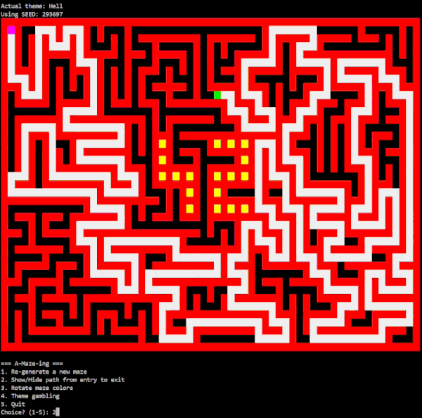
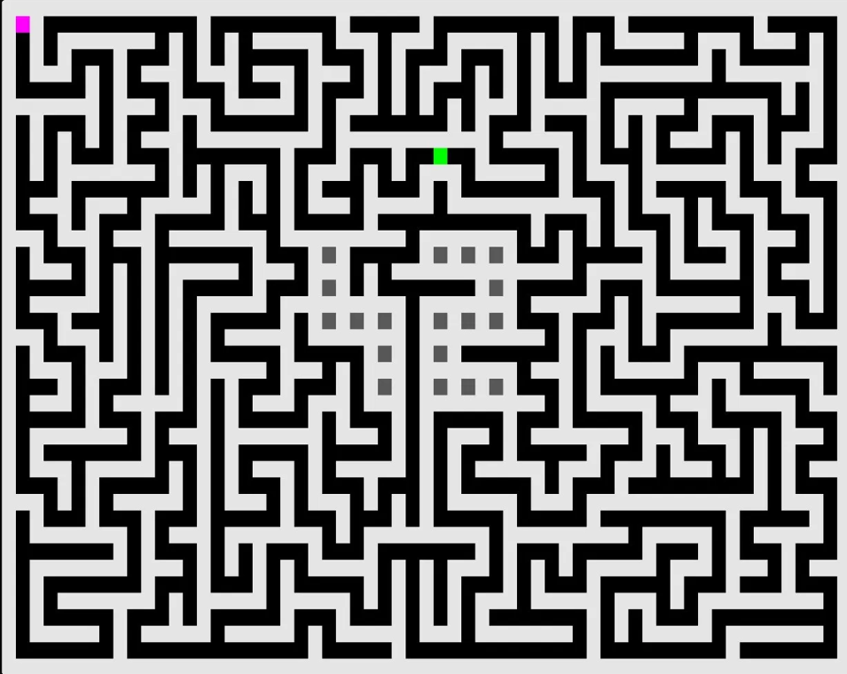
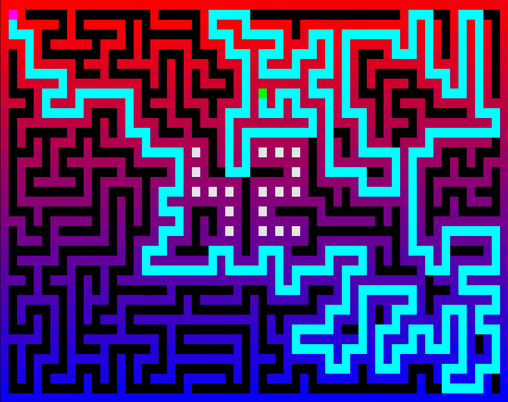

# A-Maze-ing — Maze Generator & Solver

A configurable maze generation and solving tool built in Python, with an interactive terminal interface and a reusable `mazegen` package.

*Built at 42 Barcelona by [@spujol-s](https://github.com/spujol-s) and [@esucarra](https://github.com/esucarra)*



---

## Overview

A-Maze-ing generates valid mazes from a config file, computes the shortest path from entry to exit using BFS, and renders everything in the terminal with full color support and interactive controls. The maze structure is also exported to a hexadecimal file for external validation.

The core generation logic is packaged as a standalone `mazegen` Python package, so it can be reused independently of the UI.

---

## Visuals

<table>
  <tr>
    <th>Default theme</th>
    <th>Random color theme</th>
  </tr>
  <tr>
    <td></td>
    <td></td>
  </tr>
</table>

The "42" pattern is embedded in every maze large enough to fit it — rendered in a contrasting color relative to the active theme.

---

## Features

- **Maze generation** via recursive backtracking (iterative with a stack)
- **Perfect and imperfect mazes** — imperfect mode removes dead-end walls randomly to create multiple valid paths
- **BFS pathfinding** — guaranteed shortest path from entry to exit
- **Reproducible generation** via optional `SEED` parameter
- **Interactive terminal controls** — no restart needed to explore options
- **Color themes** — rotate through predefined themes or trigger a random animated theme change
- **Hexadecimal export** — maze structure encoded as bit flags (N/E/S/W per cell)
- **Reusable `mazegen` package** — core logic decoupled from the UI

---

## Interactive Controls

```
=== A-Maze-ing ===
1. Re-generate a new maze
2. Show/Hide path from entry to exit
3. Rotate maze colors
4. Theme gambling
5. Quit
```

The terminal clears and redraws cleanly on every interaction — no output stacking.

---

## Installation & Usage

### Requirements

- Python 3.10+
- `make`

### Install

```bash
make install
```

### Run

```bash
make run
```

Or manually:

```bash
python3 a_maze_ing.py config.txt
```

### Other targets

```bash
make lint         # flake8 + mypy
make lint-strict  # flake8 + mypy --strict
make debug        # run with pdb
make clean        # remove venv, caches
```

---

## Configuration

Edit `config.txt` before running:

```
WIDTH=40
HEIGHT=30
ENTRY=0,0
EXIT=38,28
OUTPUT_FILE=output.txt
PERFECT=no
#SEED=293697
```

| Key | Description |
|:---|:---|
| `WIDTH` / `HEIGHT` | Maze dimensions (int, 1 < x < 999) |
| `ENTRY` / `EXIT` | Coordinates as `x,y` |
| `OUTPUT_FILE` | Output filename (`.txt`) |
| `PERFECT` | `true/false` — single path vs multiple paths |
| `SEED` | Optional integer for reproducible generation |

---

## Algorithm

**Generation** — recursive backtracking implemented iteratively with a stack. Produces perfect mazes by default (one unique path between any two cells). In imperfect mode, dead-end walls are removed randomly after generation to introduce loops.

**Pathfinding** — BFS guarantees the shortest valid path from `ENTRY` to `EXIT`. The path is stored as a sequence of N/E/S/W directions and overlaid on the maze display when enabled.

**Output encoding** — each cell is stored as a single hex digit where bits 0–3 represent walls (North, East, South, West). A closed wall = 1, open = 0.

---

## Project Structure

```
A-Maze-ing/
├── a_maze_ing.py       # Entry point and main loop
├── create_config.py    # Config parsing and Pydantic validation
├── maze_display.py     # Terminal renderer and color themes
├── package/
│   └── mazegen.py      # MazeGenerator class (reusable)
├── config.txt
├── Makefile
├── pyproject.toml
└── requirements.txt
```

---

## mazegen Package

The core generation logic is available as a standalone package:

```bash
pip install mazegen-1.0.0.tar.gz
```

```python
from mazegen import MazeGenerator

maze = MazeGenerator(width=20, height=15, perfect=True, seed_number=42)
maze.sign_42()
maze.generate()
path = maze.solve_bfs(start=(0, 0), end=(19, 14))
coords = maze.get_path_coords(start=(0, 0), path_str=path)
```

---

## Team

| | Contribution |
|:---|:---|
| **@spujol-s** | Config parsing and Pydantic validation, interactive terminal UI, main loop logic, show/hide path, color rotation, regenerate, seed implementation, path rendering in `maze_display.py`, BFS improvements for path display, Makefile, mazegen package (joint) |
| **@esucarra** | Original config parser, maze generation algorithm, BFS base implementation, hexadecimal file export, visual improvements in `maze_display.py`, mazegen package (joint) |

---

## Resources

- [Breadth-First Search — Wikipedia](https://en.wikipedia.org/wiki/Breadth-first_search)
- [Recursive Backtracker — Maze Generation](https://en.wikipedia.org/wiki/Maze_generation_algorithm#Randomized_depth-first_search)
- [Pydantic Documentation](https://docs.pydantic.dev/)
